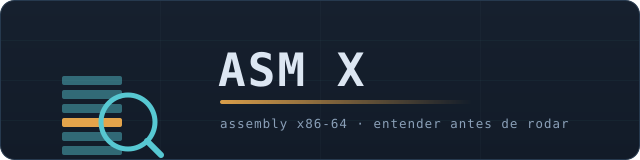
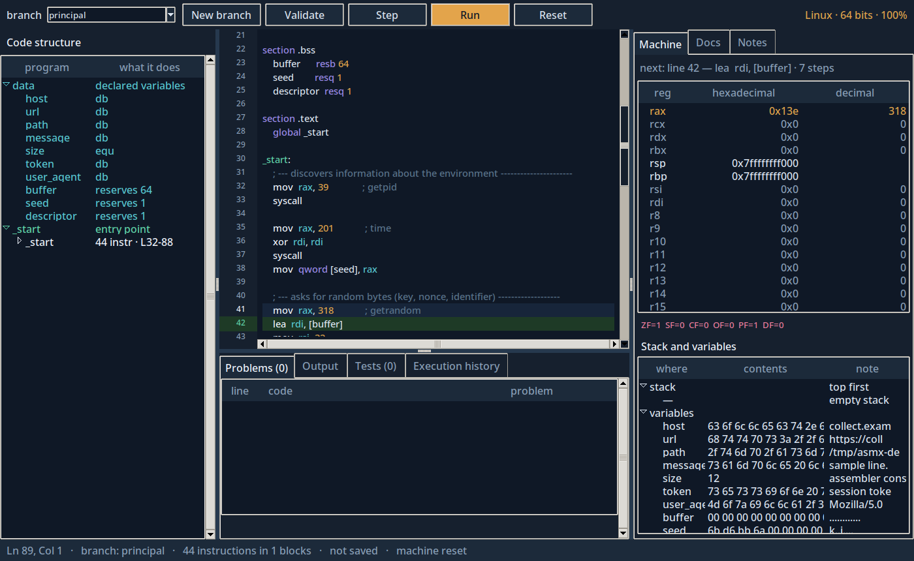
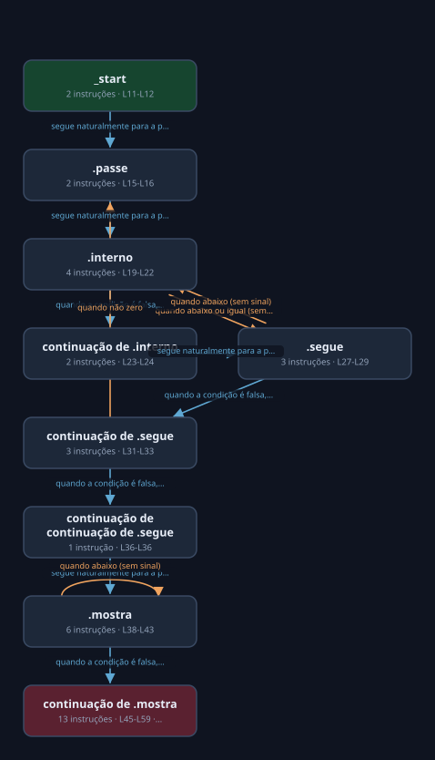
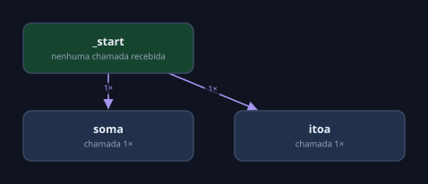
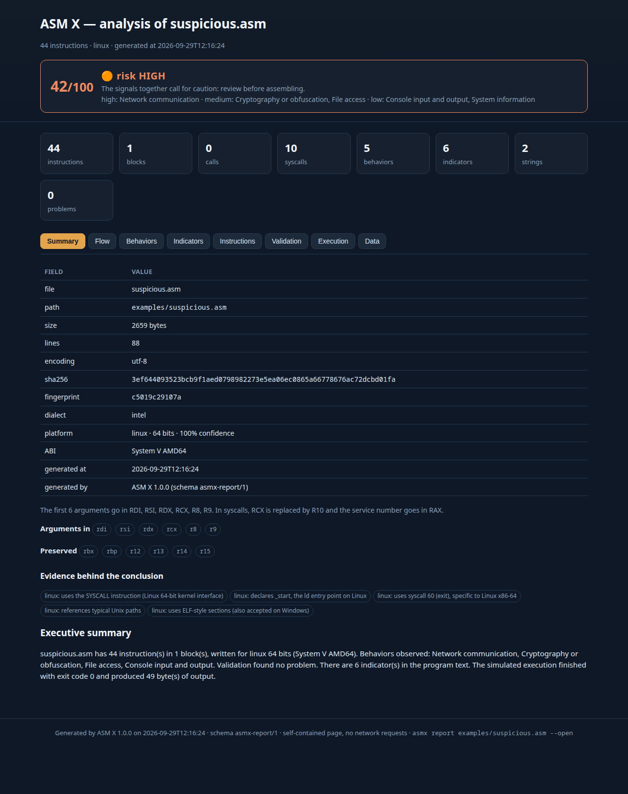

<div align="center">



**Understand assembly before running it.**

It reads the code, explains every instruction, points out what will break and
runs it step by step inside a virtual machine that never touches your system.

Python + Tkinter. No server, no binary, no external dependency.

<sub>Repository <code>x86-assembly-visualizer</code> · project <b>ASM X</b> · Python package <code>asmx</code></sub>

</div>

```text
 █████╗  ███████╗ ███╗   ███╗    ██╗  ██╗
██╔══██╗ ██╔════╝ ████╗ ████║    ╚██╗██╔╝
███████║ ███████╗ ██╔████╔██║     ╚███╔╝
██╔══██║ ╚════██║ ██║╚██╔╝██║     ██╔██╗
██║  ██║ ███████║ ██║ ╚═╝ ██║    ██╔╝ ██╗
╚═╝  ╚═╝ ╚══════╝ ╚═╝     ╚═╝    ╚═╝  ╚═╝
```

[](https://www.python.org)
[](LICENSE)
[](#install)
[](#quality)
[](#quality)
[](#quality)
[](#quality)
[](#install)

[](https://github.com/Rafawaldrigues/x86-assembly-visualizer/actions/workflows/tests.yml)
[](https://github.com/Rafawaldrigues/x86-assembly-visualizer/actions/workflows/security.yml)

---

**In this README:** [Quick start](#quick-start) · [What it does](#what-it-does) ·
[Why it exists](#why-it-exists) · [Architecture](#architecture) · [Install](#install) ·
[Usage](#usage) · [Reports](#reports) · [Signature rules](#signature-rules) ·
[Dashboard and grouping](#dashboard-and-grouping) · [Where it stops](#where-it-stops) ·
[Quality](#quality) · [Structure](#structure) · [Roadmap](#roadmap)

## Quick start

```bash
git clone https://github.com/Rafawaldrigues/x86-assembly-visualizer && cd x86-assembly-visualizer

python3 asmx.py                                    # opens the desktop interface
python3 -m asmx check examples/broken.asm          # or use the command line
python3 -m asmx report examples/suspicious.asm --open   # and look at the report
```



<sub>The window: code structure on the left, editor with highlighting and
breakpoints in the middle, machine (registers, flags, stack and variables) on the
right — and the line under the cursor explained at the bottom.</sub>

The only requirement is Python 3.9 or newer. On Linux, Tkinter ships as a
separate package (`sudo apt install python3-tk`) — and that is the only one: ASM X
installs no third-party library.

## What it does

### 1. Explains the code, line by line

Every instruction gets a tag ("Writes to memory", "Jumps if equal", "System
call") and a sentence describing its effect. Labels, data and directives are
explained too.

```console
$ python3 -m asmx explain examples/linux-hello.asm --line 13
line 13 MOV
  mov rdi, 1              ; descriptor 1 = stdout
  Sets a constant — rdi becomes 1.
  syntax   MOV destination, source
  flags    Does not change flags.
```

### 2. Validates before assembling

15 checks producing 34 problem codes, each one with a fix hint: a non-ASCII
string that blows the size, `div` without clearing RDX, `push` without `pop`,
`mov al, 300`, an infinite loop, Windows shadow space, a missing label, a write
into `.rodata`, a register read before it is set, and so on.

```console
$ python3 -m asmx check examples/broken.asm
broken.asm (697 bytes · 24 lines · sha256 5f3c7117f63b…)
  platform  linux · 64 bits · 100% confidence  (System V AMD64)
  10 instructions · 3 blocks · 0 syscall(s) · 1 call(s) · 3 label(s)
  error   L14   DIV001  DIV without preparing RDX in this block
         → the CPU divides RDX:RAX; with garbage in RDX the quotient overflows and raises an exception. Put XOR RDX, RDX before it.
  error   L15   STK001  divide returns with 1 extra value(s) on the stack
         → every PUSH needs its matching POP before the RET, otherwise the RET takes the wrong value and jumps to an invalid address
  error   L18   IMM001  the value 300 does not fit in al (8 bits)
         → the assembler truncates or refuses it. Use a larger register or review the constant.
  error   L19   MEM001  ambiguous operand size
         → the assembler does not know whether to write 1, 2, 4 or 8 bytes. Write mov byte [..], 1
  error   L19   SYM003  counter is not defined anywhere
  6 error(s), 3 warning(s), 0 info(s)
```

### 3. Runs without running

The virtual machine interprets the assembly directly: registers, flags, stack and
memory in view, breakpoints in the gutter, a history of what each instruction
did, and detection of what would go wrong on a real CPU (overflow, division by
zero, unbalanced stack, memory never written, `RET` picking up garbage).

```console
$ python3 -m asmx run examples/linux-function.asm
linux-function.asm · entry: program entry point
  output:
    42
  47 instructions · exit code 0
  RAX=0x3c  RSP=0x7ffffffff000
  run with no problems
```

### 4. Detects the platform and the ABI

Linux/System V or Windows/Microsoft x64, with the evidence behind the conclusion
and the calling rules of each one: which registers carry arguments, which must be
preserved and how much shadow space Windows expects.

```console
$ python3 -m asmx info
ASM X 1.0.0
  python 3.14.7 · tkinter 9.0
  catalog: 148 instructions · 11 categories · 43 Linux syscalls · 18 Windows APIs
  validation: 15 rules · examples: 9
  configuration: timeout=30s · max_steps=200000 · memory=512MB · network=off · log=INFO · workers=4
  log: WARNING · json=False
```

### 5. Says what the program does

Twelve behaviour categories with line-by-line evidence, a confidence value and a
mapping to MITRE ATT&CK — as an **indication** derived from static patterns, never
as proof. It is the difference between "44 instructions" and "opens a network
socket, writes a file under `/tmp` and asks for random bytes".

```console
$ python3 -m asmx analyze examples/ --out results | grep suspicious
  suspicious.asm               HIGH      42/100    44 instr   5 behav    6 IOC   0 prob  Network communication, Cryptography or obfuscation, File access
```

### 6. Extracts indicators and strings

URLs, valid IPv4 addresses, domains, e-mail addresses, Unix and Windows paths,
registry keys, quoted commands, sensitive extensions, keywords and the strings
embedded in the program — each one with the line where it appears, and filtered
against false positives (`source.asm` is not a domain, `1.2.3.4.5` is not an IP).

### 7. Draws the flow and the calls

Control-flow and call graphs rendered as plain SVG (no drawing library), with
blocks coloured by role, the reason written on every arrow and dead code visible
instead of hidden. They also come out as DOT (Graphviz) and Mermaid, ready to
edit or paste into a document.



Each box is a basic block; the colour tells its role (entry, ordinary block,
exit), the text tells how many instructions it holds and in which lines, and each
arrow carries the reason for the branch. The call graph follows the same idea:



### 8. Produces a report you look at

```bash
python3 -m asmx report examples/suspicious.asm --open   # self-contained HTML, opens in the browser
python3 -m asmx analyze examples/ --out results/        # one report per file plus an index
```



The HTML carries its CSS, its JavaScript and the graphs inline: it opens offline,
with no CDN and no server, and can be attached to an e-mail or a commit. The tabs
are Summary (with a 0–100 risk score), Flow, Behaviors, Indicators, Instructions,
Validation, Execution with a timeline, and the raw data. The same content comes
out as Markdown, JSON, DOT, SVG and Mermaid:

```bash
python3 -m asmx report prog.asm --format md                # Markdown with Mermaid
python3 -m asmx report prog.asm --format json | jq .       # schema asmx-report/1
python3 -m asmx report prog.asm --format dot | dot -Tsvg -o flow.svg
python3 -m asmx report prog.asm --no-emulate               # static only, nothing executed
python3 -m asmx report prog.asm --fail-on high             # exit 1 when the risk is high
```

In the graphical interface it is *Run › Generate report…* (`Ctrl+R`).

### 9. Matches signature rules

`asmx scan` runs a YARA-like rule set over the source and reports what fired, with
the line that made it fire. Rules are plain JSON, they ship inside the package and
you can point at your own directory instead.

```console
$ python3 -m asmx scan examples/suspicious.asm
rules: 22 rule(s) from …/asmx/data/rules

  suspicious.asm 8 rule(s) matched: 4 high, 2 medium, 2 low
    IMP001  high     Recursive file walk with writes
            line 52: syscall open
            line 59: syscall write
            line 45: syscall getrandom
    NET001  high     Socket opened or connected
            line 70: syscall socket
            line 77: syscall connect
    NET002  high     Hardcoded host or URL
            line 4: `https?://[a-z0-9.-]+` -> … url db "https://collect.example.com/beacon"…
```

None of the 22 rules fire on the nine example programs except `suspicious.asm` —
a rule set that flags everything is a rule set nobody reads. There is a test that
enforces exactly that. The full format is in
[`docs/RULES.md`](docs/RULES.md).

### 10. Groups a folder and shows it in the browser

```console
$ python3 -m asmx cluster examples/ --threshold 0.85
cluster: 9 file(s) · 8 group(s) · threshold 0.85 (single linkage)

  2 file(s) cohesion 0.92
      shared signal: behavior:console-io
      linux-hello.asm
      linux-loop.asm
```

`asmx analyze` writes one report per file plus `index.html` (comparative table)
and `index.json` (the manifest another tool can read). `asmx dashboard` then
serves that folder on `127.0.0.1`, read-only, with search, sorting and links to
the full reports — and requires a token automatically if you expose it beyond the
loopback interface.

### 11. Helps you test hypotheses

- **Branches**: variations of the same program inside a project, with a diff
  between them — change a constant, compare, go back.
- **Test scenarios**: initial state (where to start, which registers) plus the
  expectation (output, exit code, or "must report a problem"). It is how you
  answer "what happens if this number is huge?".
- **Per-line notes**, stored in the project and out of the `.asm` file.
- **9 example programs**, from a syscall hello-world to a didactic program that
  talks to the system (network, file, randomness).

### 12. Fits automation

A complete command line with JSON output, stable exit codes (0 all good, 1
problems found, 2 usage error, 3 input error, 4 timeout), structured logging and
a configuration file.

```console
$ python3 -m asmx check examples/linux-hello.asm --json
{
  "schema": "asmx-check/1",
  "command": "check",
  "files": [
    {
      "source": {
        "name": "linux-hello.asm",
        "size": 621,
        "lines": 20,
        "encoding": "utf-8",
        "sha256": "39fccdddcc6a…",
        "fingerprint": "39fccdddcc6a"
      },
      "platform": {"os": "linux", "bits": 64, "confidence": 100, "abi": "System V AMD64"},
      "stats": {"instructions": 8, "blocks": 1, "syscalls": 2, "calls": 0, "labels": 1},
      "problems": [],
      "summary": {"errors": 0, "warnings": 0, "infos": 0}
    }
  ],
  "summary": {"files": 1, "errors": 0, "warnings": 0, "infos": 0},
  "exit_code": 0
}
```

## Why it exists

Assembly is where the machine stops being abstract. It is also where a beginner
loses the most time: the manual explains the instruction, but not the mistake in
front of them, and the only way to test is to assemble, link and run something
that may well hang the machine.

ASM X sits between the manual and the assembler:

- it explains the code in plain language, instruction by instruction;
- it points out the classic mistake **before** you assemble;
- it executes in a didactic virtual machine, so an infinite loop is a message and
  not a reboot;
- it shows what the program looks like from the outside: behaviour, indicators,
  graphs and a report you can share.

It is a study and review tool. It does not replace `nasm`, `ld` and `gdb` — it
saves you a round trip to them.

## Architecture

```text
        ┌────────────────────────────────────────────────────┐
        │  ui/ — Tkinter: editor, panels, dialogs            │
        │  cli.py — check, run, explain, report, analyze,    │
        │  scan, rules, cluster, dashboard, info, examples   │
        └───────────┬──────────────────────────┬────────────┘
                    │                          │
        ┌───────────▼──────────────┐  ┌────────▼────────────┐
        │  parser.py — NASM/Intel, │  │  workspace.py —     │
        │  MASM and GAS/AT&T       │  │  project, branches, │
        └───────────┬──────────────┘  │  notes, scenarios   │
                    │                 └─────────────────────┘
        ┌───────────▼──────────────────────────────────────┐
        │  analyzer.py — platform, ABI, semantics, blocks   │
        │  emulator.py — didactic virtual machine           │
        │  linter.py — 15 checks, 34 problem codes          │
        └───────────┬──────────────────────────────────────┘
                    │
        ┌───────────▼──────────────────────────────────────┐
        │  behavior.py    what the program does + ATT&CK    │
        │  iocs.py        strings, URLs, IPs, paths, keys   │
        │  rules.py       signature rules (YARA-like)       │
        │  similarity.py  grouping by feature vectors       │
        │  cfg.py         control-flow and call graphs      │
        └───────────┬──────────────────────────────────────┘
                    │
        ┌───────────▼──────────────────────────────────────┐
        │  report.py — self-contained HTML, Markdown, JSON, │
        │  DOT, SVG, Mermaid, batch index and manifest      │
        │  dashboard.py — local read-only viewer            │
        └──────────────────────────────────────────────────┘
```

Every layer is a plain Python module with no dependency, and the data each one
produces is a dictionary you can print, test and reuse.

## Install

### From source (recommended)

```bash
git clone https://github.com/Rafawaldrigues/x86-assembly-visualizer
cd x86-assembly-visualizer
python3 asmx.py                 # nothing to install
```

### As a package

```bash
python3 -m pip install .        # installs the asmx and asmx-gui commands
asmx check examples/linux-hello.asm
```

### With Docker

```bash
docker build -t asmx .
docker run --rm asmx check examples/linux-hello.asm
docker run --rm -v "$PWD:/data" asmx report /data/prog.asm --format md
xvfb-run -a docker run --rm asmx gui        # the interface, through a virtual display
```

## Usage

### Graphical interface

```bash
python3 asmx.py
```

| Shortcut | Action |
|---|---|
| `Ctrl+O` / `Ctrl+S` | open / save the source |
| `F5` | validate |
| `F8` | run one step |
| `F9` | run to the end |
| `F10` | reset the machine |
| `Ctrl+B` | new branch |
| `Ctrl+R` | generate the report |
| `F1` | documentation of the instruction under the cursor |

### Command line

| Command | What it does |
|---|---|
| `asmx check FILE…` | analyses, validates and summarises (JSON with `--json`) |
| `asmx run FILE` | runs in the virtual machine, with `--stdin`, `--entry`, `--limit` |
| `asmx explain FILE --line N` | explains one line, or `--mnemonic mov` for the catalogue |
| `asmx report FILE` | report in `html`, `md`, `json`, `dot`, `svg`, `mermaid` |
| `asmx analyze PATHS…` | batch: one report per file, `index.html` and `index.json` |
| `asmx scan PATHS…` | matches the signature rules and shows the evidence |
| `asmx rules` | lists the rule set in effect |
| `asmx cluster PATHS…` | groups files by similarity |
| `asmx dashboard DIR` | serves a folder of reports on `127.0.0.1` |
| `asmx info` | version, catalogue and configuration |
| `asmx examples --list` | the nine example programs |

```bash
python3 -m asmx check examples/ --json | jq '.summary'
python3 -m asmx analyze examples/ --out results --format html --jobs 4 --cluster
python3 -m asmx scan examples/ --fail-on high     # exit 1 when something serious fires
python3 -m asmx cluster examples/ --threshold 0.9 --top 5
python3 -m asmx dashboard results --open
```

### As a library

```python
from asmx import analyze, validate, summary, collect, write_report

analysis = analyze(open("program.asm").read())
print(analysis.platform.os, analysis.platform.bits)
print(summary(validate(analysis)))

write_report(collect(analysis.program.source), "program.html")
```

### Configuration

`asmx.json`, `asmx.yaml` or `asmx.yml` in the working directory, or `--config PATH`,
or environment variables with the `ASMX_` prefix:

| Field | Default | Meaning |
|---|---|---|
| `timeout` | `30` | maximum time of a simulated run, in seconds |
| `max_steps` | `200000` | instruction limit of a run |
| `max_bytes` | `1048576` | maximum source size |
| `output_dir` | `results` | where reports are written |
| `log_level` | `WARNING` | `DEBUG`, `INFO`, `WARNING`, `ERROR` or `CRITICAL` |
| `log_json` | `false` | log as JSON, one event per line |
| `workers` | `4` | reserved for the parallel tools |

### Structured logging

```bash
python3 -m asmx check prog.asm -v --log-json --log-file run.log
```

Every relevant step emits an event with a name and fields (`check_finished`,
`report_written`, `rules_matched`, `dashboard_started`…), in text or JSON, which
makes the tool easy to follow inside a pipeline.

### Errors with a code

Every failure carries a stable code (`ERR_SOURCE_NOT_FOUND`, `ERR_CONFIG`,
`ERR_TIMEOUT`, `ERR_PROJECT_FORMAT`…), the path involved and a readable message —
the same code in the terminal, in the JSON and in the log.

## Reports

Six formats, one source of truth:

| Format | Best for |
|---|---|
| `html` | reading and sharing: 8 tabs, graphs inline, works offline |
| `md` | issues, pull requests and documentation (Mermaid renders on GitHub) |
| `json` | another tool: schema `asmx-report/1`, stable keys |
| `dot` | editing the graph in Graphviz |
| `svg` | embedding the graph anywhere |
| `mermaid` | pasting the graph into Markdown |

`asmx analyze` adds the comparative index (`index.html`) and the manifest
(`index.json`, schema `asmx-analyze/1`) that the dashboard reads:

```console
$ python3 -m asmx analyze examples/ --out results --cluster
  broken.asm                   CRITICAL 100/100    10 instr   2 behav    2 IOC   9 prob  Analysis evasion, Memory manipulation
  bubble.asm                   LOW        9/100    36 instr   3 behav    1 IOC   0 prob  Data processing, Console input and output, Byte block handling
  suspicious.asm               HIGH      42/100    44 instr   5 behav    6 IOC   0 prob  Network communication, Cryptography or obfuscation, File access

summary: 9 file(s) · 2 with high or critical risk · 6 similar group(s)
  reports and manifest in results · index at results/index.html
```

## Signature rules

22 rules ship with the tool, in five themed files:

| File | Ids | Theme |
|---|---|---|
| `anti-analysis.json` | `EVA00x` | debugger checks, timing, fingerprinting, executable memory |
| `crypto-impact.json` | `CRY00x`, `IMP00x` | randomness, cipher loops, encryptor shape, locker strings |
| `evasion-pack.json` | `EXE00x` | spawning programs, shell strings, memory mapping, stream copies |
| `filesystem.json` | `FILE00x`, `PER00x` | file writes, sensitive paths, deletion, autostart, permissions |
| `network.json` | `NET00x` | sockets, embedded hosts, IPv4 literals, HTTP markers, DNS |

A rule is data, never code: `id`, `name`, `severity`, `description`, `tags`,
`mitre` and a `match` object whose keys are ANDed (`strings`, `syscalls`, `apis`,
`behaviors`, `sections`, `mnemonics`, `problems`, thresholds) with `any_of` for
alternatives and `require_all` for strictness. Text patterns are matched against
the source **with comments removed**, so a comment that merely mentions
`/etc/passwd` does not fire a rule. The format, the conditions and the limits are
documented in [`docs/RULES.md`](docs/RULES.md).

## Dashboard and grouping

```bash
python3 -m asmx analyze samples/ --out results --jobs 4 --cluster
python3 -m asmx dashboard results --open
```

The dashboard is a read-only viewer built on `http.server`: it binds to
`127.0.0.1` unless you ask otherwise, answers `GET`/`HEAD` only, refuses any path
outside the folder it was given, escapes every sample name it prints, loads no
external resource, and generates a token by itself when exposed beyond the
loopback (with a warning in the log). It also exposes `/api/samples` and
`/api/summary` as JSON.

Grouping is **algorithmic similarity, not machine learning**: each analysis turns
into a normalised feature vector (instruction mix, syscalls, behaviours,
indicators, shape), comparison is cosine similarity and grouping is single or
complete linkage over a threshold you choose. It is deterministic, explainable
and needs no dependency — and the report says which signal the group shares.

## Where it stops

Written down on purpose, because a tool that hides its limits cannot be trusted:

- **It never assembles, links or executes a real binary.** There is no `nasm`,
  no `ld`, no `subprocess` and no `exec` in the execution path: the assembly is
  data, and what runs is the Python of ASM X.
- **The virtual machine covers integer x86-64, not everything.** SSE, most
  syscalls, macros and part of the instruction set are out; `asmx info` prints
  what the catalogue knows, and an unemulated instruction is reported, not
  guessed.
- **The behaviour classifier is heuristic.** It reads static patterns (syscalls,
  APIs, loops, strings) and says "indication", with the evidence and a
  confidence. It is not proof of intent, and the MITRE ATT&CK mapping inherits
  that limit: it guides the reading, it does not replace an analyst.
- **Rules are signatures.** A rule can be evaded by computing strings at runtime;
  the engine reports what it saw, with the line, and never claims a verdict.
- **The report fetches nothing from the network.** No CDN, no remote font, no
  telemetry: the HTML is a single file and the MITRE links are references you
  decide to open.
- **Passing here does not replace `nasm` + `ld` + `gdb`.** It is here to help you
  understand the code and find the mistake earlier.

## Quality

| Gate | Result |
|---|---|
| Tests | 1445 cases, pure `unittest` (core + interface under `xvfb`) |
| Coverage | 97% branch coverage over `asmx/`, minimum enforced at 94% |
| Type hints | 100% of parameters and returns annotated |
| Docstrings | 100% Google-style, checked by a gate with its own rule codes |
| mypy | clean over the whole package |
| flake8 | clean at 100 columns |
| black | stable formatting, `--line-length 100` |
| bandit | no medium or high findings |
| Dependencies | zero at runtime |

```bash
make test        # full suite
make coverage    # coverage with the minimum threshold
make quality     # flake8 + mypy + gates + coverage
make format      # black
```

All of it runs in CI on every push, on Python 3.9, 3.10, 3.11, 3.12 and 3.13,
plus a security sweep (bandit + pip-audit), a check that the generated reference
and the examples are in sync, and a test proving the package installs and works
in an empty `venv`.

## Structure

```text
asmx.py                  shortcut to run without installing
asmx/
  isa.py                 catalogue: 148 instructions, 11 categories, 43 syscalls, 18 APIs
  parser.py              NASM/Intel, MASM and GAS/AT&T
  analyzer.py            platform, ABI, semantics, blocks and flow
  emulator.py            didactic virtual machine
  linter.py              15 checks, 34 problem codes
  behavior.py            behaviours + MITRE ATT&CK mapping
  iocs.py                strings, URLs, IPs, domains, paths, registry
  rules.py               signature rule engine (YARA-like)
  similarity.py          feature vectors, cosine similarity, clustering
  cfg.py                 control-flow and call graphs (layout + SVG/DOT/Mermaid)
  report.py              report in HTML, Markdown, JSON, DOT, SVG and Mermaid
  dashboard.py           local read-only viewer for a folder of reports
  workspace.py           project, branches, notes, scenarios
  config.py              configuration (file, environment, defaults)
  errors.py              exceptions with stable codes
  logging_setup.py       structured log in text or JSON
  source.py              file reading with hash and encoding detection
  cli.py                 command line
  ui/                    Tkinter interface (editor, panels, dialogs)
  data/isa.json          the documentation catalogue
  data/rules/*.json      the 22 signature rules
examples/                9 ready-to-open .asm programs
docs/GUIA.md             user manual
docs/REFERENCIA.md       reference of the 148 mnemonics
docs/RULES.md            signature rule format
docs/WALKTHROUGHS.md     guided readings of the examples
tests/                   test suite
tools/                   quality gates and generators
assets/                  logo, interface and report captures, sample graphs
Dockerfile               image with an unprivileged user and usage targets
pyproject.toml           packaging and tool configuration
```

## Documentation

- [`docs/GUIA.md`](docs/GUIA.md) — manual: interface, command line, report,
  configuration, logging, validator rules, limits.
- [`docs/REFERENCIA.md`](docs/REFERENCIA.md) — the 148 mnemonics, syscalls and
  Windows APIs, generated from the same catalogue the Docs tab uses.
- [`docs/RULES.md`](docs/RULES.md) — how to write and test a signature rule.
- [`docs/WALKTHROUGHS.md`](docs/WALKTHROUGHS.md) — five guided readings of the
  example programs, with the real output of each command.
- [`CHANGELOG.md`](CHANGELOG.md) — what changed in each version.
- `asmx explain --mnemonic mov` — the documentation also lives in the terminal.

## Roadmap

**v1.0 (current)** — the whole core: three dialects, semantic analysis, platform
detection, validation, virtual machine, behaviours with MITRE ATT&CK, indicators,
signature rules, similarity grouping, control-flow and call graphs, report in six
formats, batch with an index and a manifest, local dashboard, graphical interface,
command line, logging, configuration, CI and Docker.

**v1.1 (next)** — more instructions in the virtual machine (SSE, more syscalls),
SARIF export for code review, a rule editor in the interface, and parallel
analysis by default.

**v2.0 (future)** — ARM/MIPS in the virtual machine, NASM macros, publishing on
PyPI and an optional REST API.

## License

MIT — see [`LICENSE`](LICENSE).

## Acknowledgements

The instruction catalogue follows the Intel and AMD manuals; the Windows side
follows Microsoft Learn; the ATT&CK mapping follows the
[MITRE ATT&CK](https://attack.mitre.org) knowledge base. The tone of the messages
owes a lot to the manuals that explain *why*, not only *what*.
